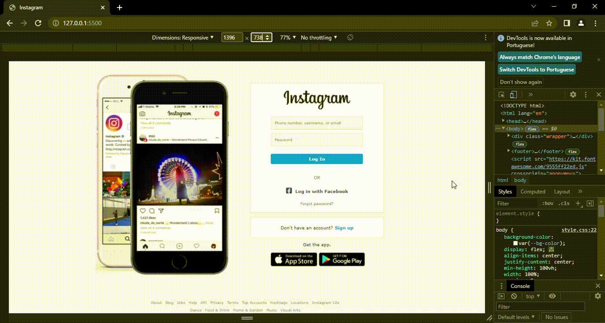

# Recriando a página inicial do Instagram

Projeto desenvolvido para o desafio de recriar a página inicial do Instagram. Para recriar a página foi necessário utilizar conhecimentos em HTML e CSS.

##  Responsividade

# Acesse a página clicando [aqui](https://joi-gn.github.io/INSTAGRAMLOGINPAGE-recriando-interface-instagram/)
