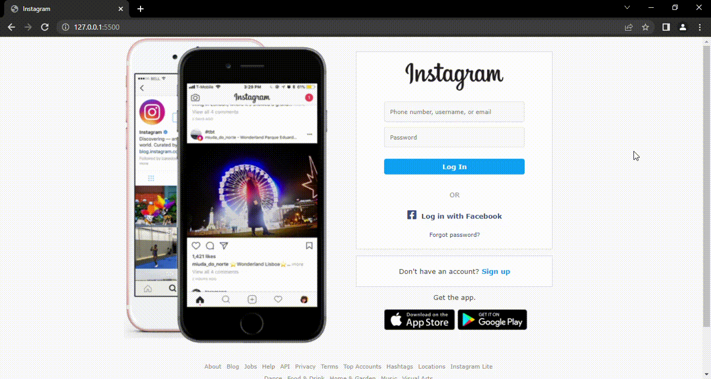

# Recriando a página inicial do Instagram

Projeto desenvolvido para o desafio de recriar a página inicial do Instagram. Para recriar a página foi necessário utilizar conhecimentos em HTML e CSS.

##  Responsividade

